在价格行为学里，50%回调是一种很常见的价格行为。Al Brooks和很多价格行为学博主都提到过50%回调的重要性，但大家都没有对此做深入介绍，往往只是在分析时简单带过。

然而根据我最近的研究，50%回调是一个非常值得交易的模式。选择合适的背景和入场方式后，1倍盈亏比的胜率可达到80%以上。

## 50%回调是什么

50%回调是指价格在回调到50%的位置时，往往会获得支撑/阻力，并延续原有的趋势。

为什么价格会在50%的位置停下来？因为这时价格距离前期高点和低点相等，而价格运动具有惯性，接下来恢复原有趋势的概率更高。例如，价格从100元涨到200元，随后回调到150元，这时买入的话，止盈设在200元，止损设在略低于100元的位置，盈亏比约为1:1。由于前面是上涨趋势，接下来价格先触及止盈的概率高于先触及止损的概率，值得开仓。长期来看，这可能构成一个数学期望为正的交易策略。

## 对BTC、上证50成分股的研究

根据这一特性，我花了一个半月的时间，研究了2020年～2025年的1小时级别BTC（做多+做空）和日线级别上证50成分股（仅做多）。为便于描述，接下来均从做多的角度来介绍。

开仓的条件是在背景允许的前提下，当价格上涨且收盘价高于EMA20，便在这一段上涨的50%位置开仓。如果价格没有回调而是继续上涨，则需要重新测量最低点和最高点来确定50%的位置。止盈设在这段上涨的最高点，止损设在略低于最低点的位置。开仓后采用Walmart Trade，即不做任何操作，直至止盈或止损被触发。需要说明的是，收盘价高于EMA20是我个人的开仓习惯，这一条件能过滤一部分会止损的交易，同时也可能会导致踏空，是否使用这一过滤条件可视个人习惯而定。

在这六年的回测里，BTC累计交易537笔，胜率83.80%。上证50成分股累计交易807笔，胜率84.63%，平均持仓29天，持仓中位数12天（含周末、节假日等非交易日）。

## 常见的入场背景

背景是最重要的开仓前提，只有在背景允许时才可以开仓交易。以下是50%回调常见的入场背景。

### 超强突破

强势突破往往会有第二段上涨。如下图所示，价格以连续多根超强阳线的形式强势突破，在接近前期波段高点的位置遇阻下跌。但在如此强势的突破中，第一次下跌往往会失败，从而演变成牛旗，带来第二段上涨。用斐波那契回撤工具把整段上涨连接起来，可以看到价格在回撤到50%位置时获得支撑。这时买入的话，止盈设在前期高点0的位置，止损设在略低于前期低点1的位置即可，随后价格形成双底后顺利到达止盈位。

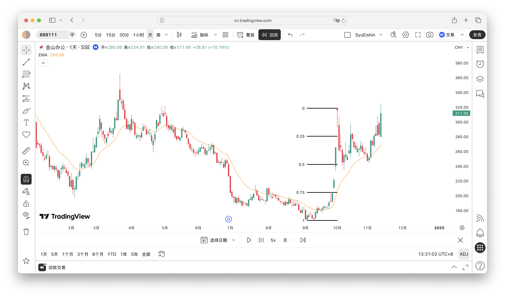

### 强趋势后的区间

在上涨趋势后期，价格回调幅度增大，开始进入交易区间，之后至少会略微突破前期高点（买入高潮、嵌套楔形等除外）。如下图所示，价格在上涨趋势后期出现楔形下跌，并在形成双底后反转向上，演变成一个潜在的区间，这时可以开仓，期待价格再次突破前期高点。

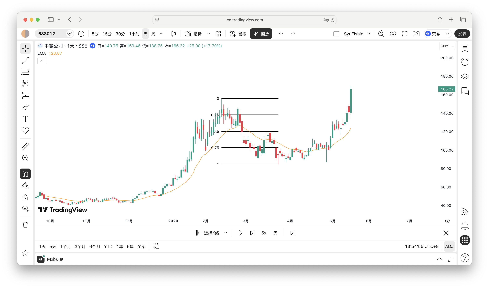

### 强趋势后的回调

与强趋势后的区间类似，强趋势在回调后往往会恢复原趋势，利用这种特征可以寻找开仓机会。如下图所示，价格在上涨趋势后期出现两段式下跌，随后以连续多根阳线的形式向上突破，这时可以认为回调结束，恢复涨势，所以我们可以在50%位置开仓，至少期待价格回到0的位置。也可以按强趋势后的区间来处理，把止盈位设在前期高点。

需要注意的是，在回测里，强趋势后回调的胜率为79%，是唯一一个胜率低于80%的形态。可能是受买入高潮、嵌套楔形等形态的影响，价格往往有更复杂的调整，第一次出现交易机会便入场的话，容易触发止损。不过79%的胜率并不低，若首次入场止损，可以等待后续调整，或改做强趋势后的区间。

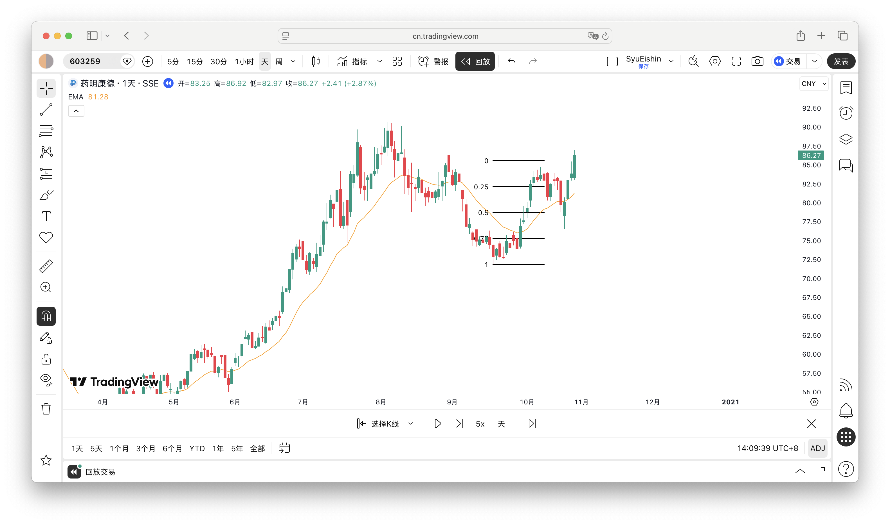

### 楔形第三推

正所谓事不过三，如果当前趋势比较强，要想逆转当前趋势，至少应出现三推楔形。也就是说，如果上涨趋势比较强，且出现了两次明显的向上推动，我们可以有较大把握判断接下来还将出现第三次上涨。如下图所示，上涨趋势较强且出现了两次明显的向上推动，一般来说，接下来的回调不会跌破第二段上涨的起点，且大概率会突破第二段上涨的终点，所以我们可以考虑在第二段上涨的50%位置开仓。

需要注意的是，楔形第三推适合顺势使用，如果前面是较强的跌势，随后出现两段式上涨，这时上涨很有可能结束了，第三推不会出现，而是恢复跌势。

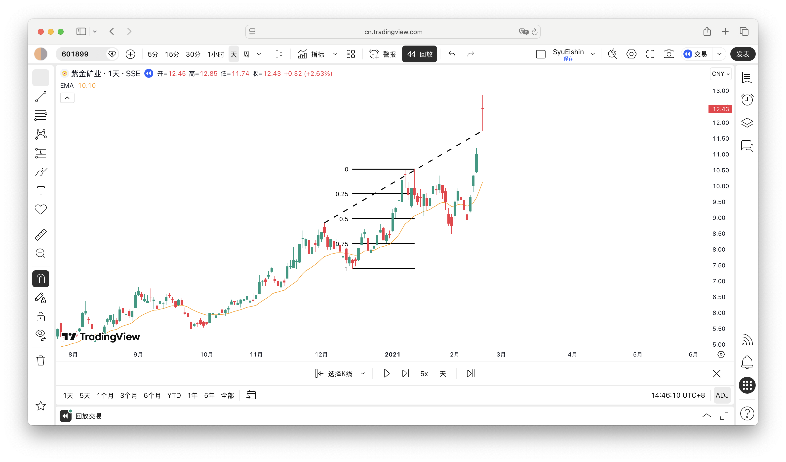

### 楔形/嵌套楔形

嵌套楔形是指楔形的第三推又是一个楔形，与普通楔形的交易含义相近，都预示着价格可能会反转。如下图所示，在嵌套楔形成形后，价格强势反转向上，这时可以在50%位置开仓。

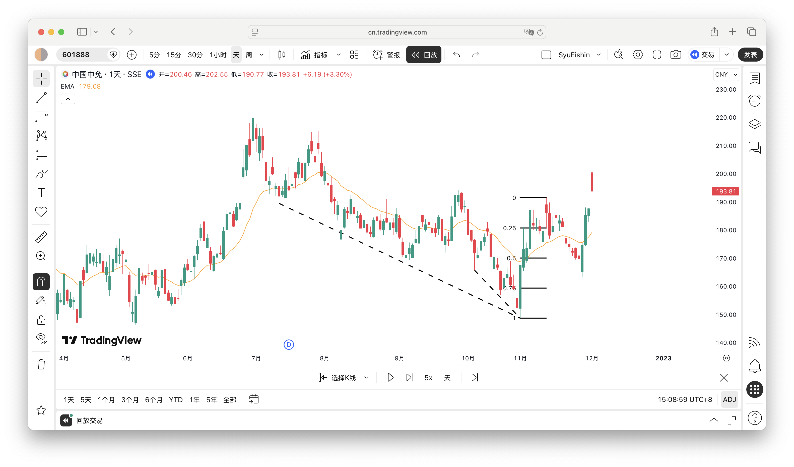

### 卖出高潮

当下跌趋势已经持续20根K线以上，这时出现更大、更急的下跌，往往是卖出高潮的表现，说明这一轮下跌可能已经结束，接下来很有可能会测试卖出高潮的起点。如下图所示，下跌趋势持续了124根K线，且出现了连续的跳空下跌，这种极端行情是不可持续的，很有可能是卖出高潮。随后价格以通道形式上涨，虽然看起来上涨很弱，但在更高的时间级别来看，这是几根连续的阳线，可以在50%位置开仓，期待价格测试卖出高潮的起点。

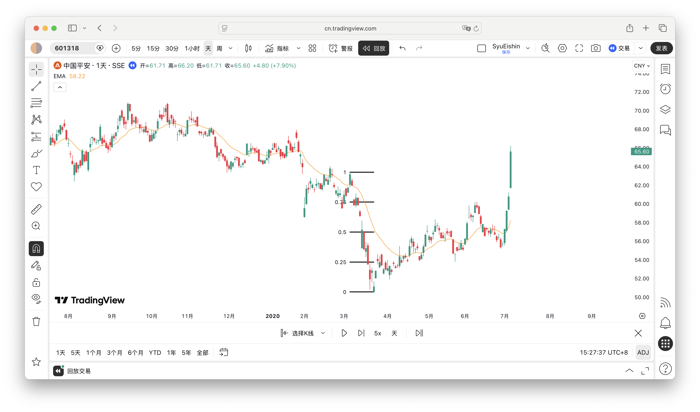

### 区间

价格在一定范围内波动，便可视为进入区间，而区间总会在某一侧被突破，问题是向上突破还是向下突破。强趋势后的区间，在原有趋势的加持下，往往会顺势突破；而一般的区间，向上和向下的概率接近50%，除非有其他迹象表明其方向性。如下图所示，价格向上突破后深幅回调，这种急涨急跌的走势是区间的表现。随后价格上涨，尽管上涨力度不强，但低点不断提高，多头相对更强，接下来可能会向上突破，可以找机会在50%位置开仓。

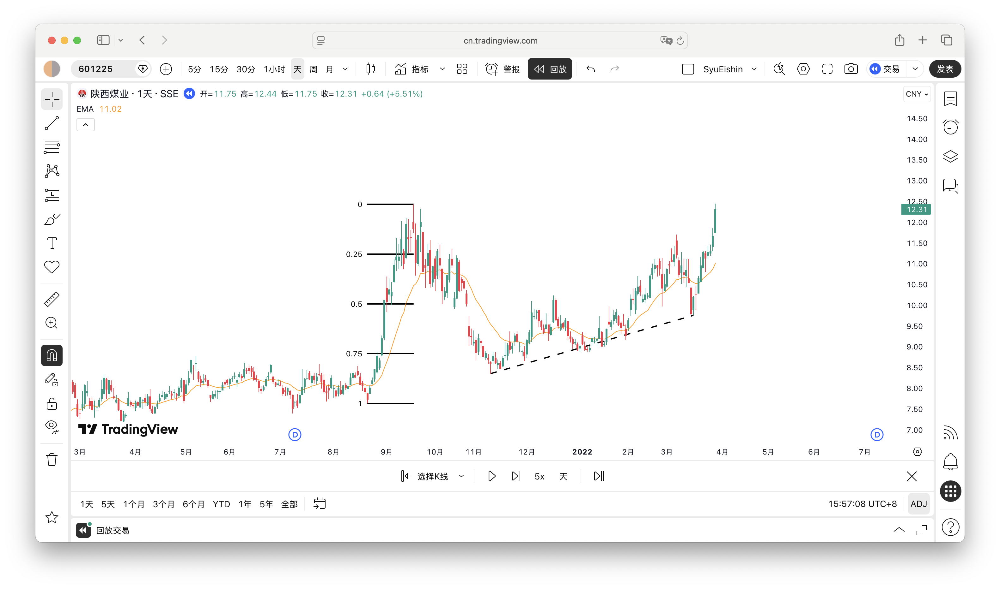

## 三种入场方式

在背景允许的前提下，价格上涨且收盘价高于EMA20，就可以考虑入场了，主要有以下三种入场方式：
- 在50%位置直接挂限价单入场，如下图的1
- 待价格跌破50%后在50%位置挂突破单入场，如下图的2
- 待价格自下而上突破50%位置后再等待回调到50%时入场，如下图的3

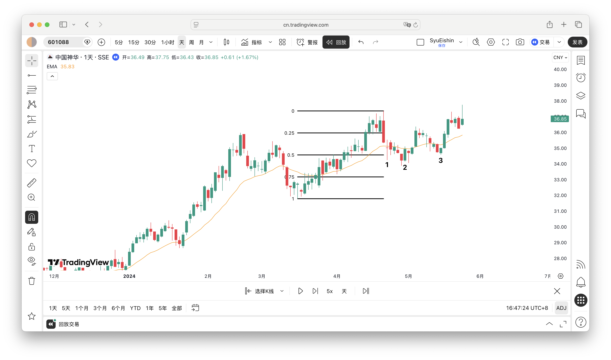

第一种方式不怕踏空，但持仓时间较长、胜率低；第三种方式持仓时间短、胜率高，但踏空概率高；而第二种则较为中庸。这三种入场方式没有优劣之分，主要看个人交易风格，选择适合自己的就好。

## 值得注意的细节

### 突破起点可能会被触发

价格运行一段时间后出现突破，接下来如果遇上深幅回调，突破的起点很有可能会被跌破。如下图所示，连续三根大阳线突破前期高点，随后遇上深幅回调，价格跌破突破起点后反转向上。如果把止损放在突破起点，容易被不必要地扫损，最好放在前一个合理的重要低点。

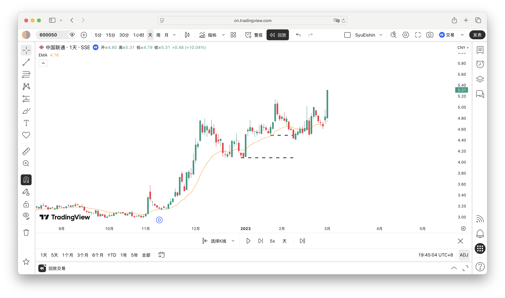

### 下方有磁力位的情况下只可做第一段

磁力位是指能吸引价格迅速到达的位置，在50%回调里，最常见的就是前期高点/低点。价格通常会至少略微突破磁力位，如果价格接近但未到达磁力位，且此时出现一个50%回调的交易机会，第一次出现可以做，但第二次、第三次遇到时最好只观望不操作。如下图所示，左边是潜在的买入高潮，接下来价格很有可能测试高潮起点，也就是说，虚线所在位置是磁力位。第一个蓝色方框出现交易机会，这时可以交易；第二个蓝色方框再次出现交易机会，但最好不要参与。

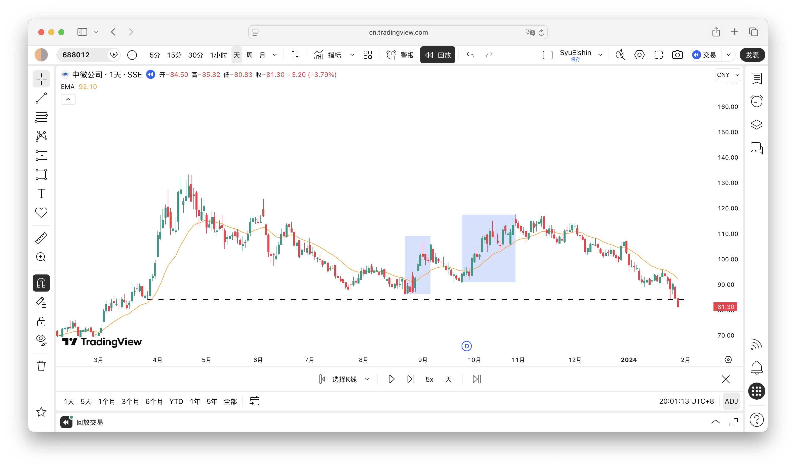

### 上方有磁力位时可以提高胜率

磁力位除了可以用来规避止损，还可以作为开仓依据。如下图所示，这个区间的最高点是233.60，而黑色箭头对应K线的最高点是232.99，未能突破前期高点这个磁力位，所以在接下来的下跌中可以找机会开仓，因为价格大概率会再次向上突破。

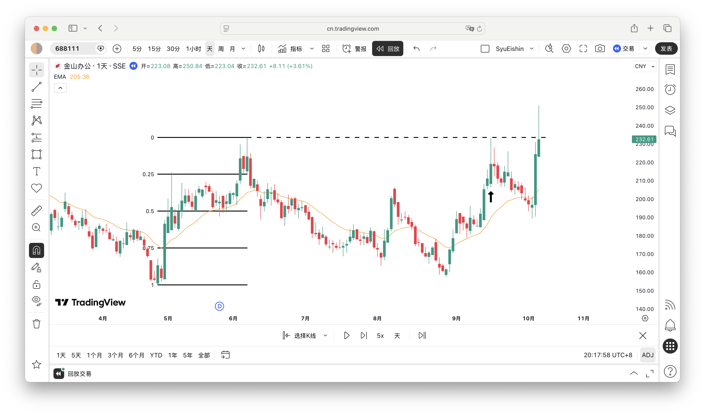

### 极端行情后第一次像样的上涨不可做

当出现买入高潮、嵌套楔形等极端行情后，价格很有可能迎来复杂调整，第一次像样的上涨不宜参与，因为此时开仓很容易止损。如下图所示，价格越涨越快，呈现抛物线式上涨，这是买入高潮的表现，意味着接下来很有可能出现复杂调整，所以不应参与蓝色方框这一段上涨，耐心等待后续行情。

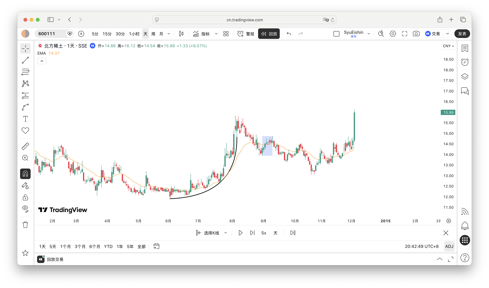

### 启动形态为通道时可以直接在50%位置挂单

如果价格以通道作为启动形态，可以考虑直接在50%位置挂限价单入场。尽管通道看起来涨势很弱，但在更高时间级别通常表现为连续趋势K线，价格回调到50%位置后可能就会反转向上。如下图所示，前面是潜在的卖出高潮，随后价格以通道形式上涨，尽管趋势不强，但跌到50%位置后马上反转，顺利到达止盈位。

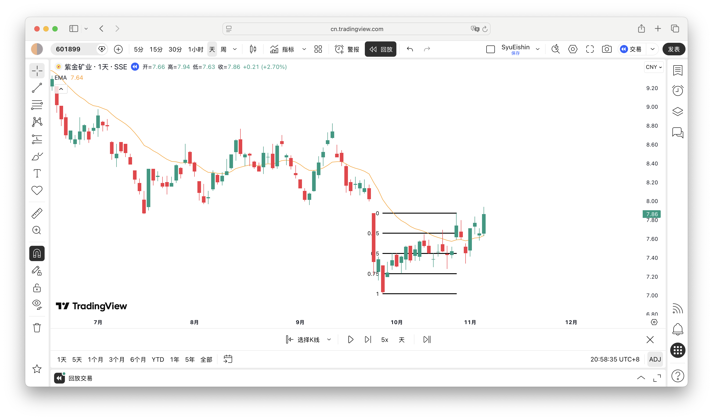

## 日后的研究方向

以上便是我这一个半月的主要研究成果。在研究过程中，我也产生了一些新的想法。例如，在75%的位置开仓，盈亏比从1:1变成3:1，盈亏比大增，踏空的可能性也大增；如果改为在50%和75%分批开仓会怎么样？或者有没有其他更好的办法？又譬如，在什么情况下价格会有多段上涨，以便将止盈设得更远。

由于工作量较大，我目前暂时没有足够精力去研究这些新的想法，先在市场里实践现有的研究策略吧，日后再结合实际情况继续迭代。
